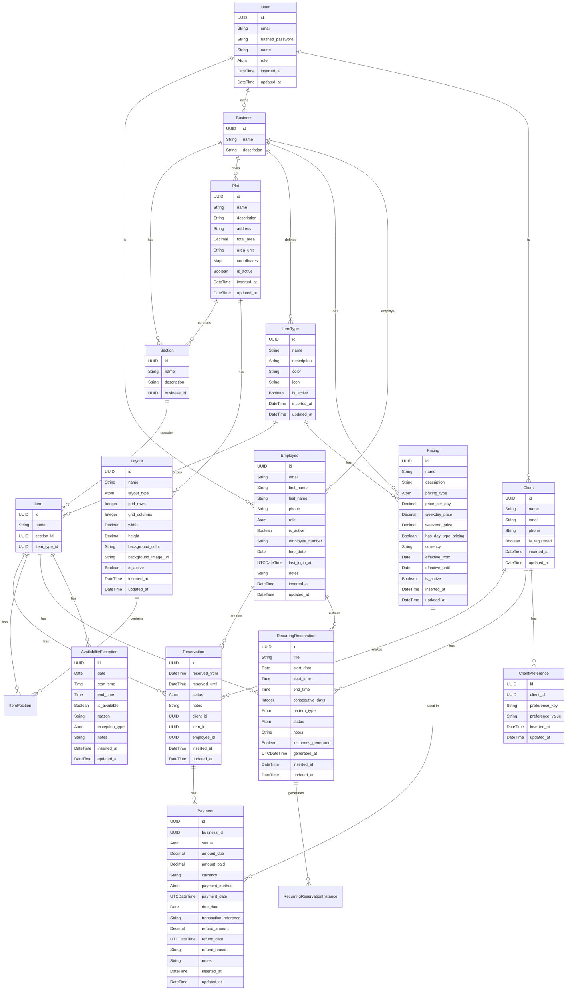

# Riva Ash Reservation System Assessment

## Implemented Reservation System Functionality

### Core Domain Model
The application implements a robust domain model centered around resource scheduling with the following key entities:

### Business Management
- Complete business entity with name, description, and ownership
- Business owners can create and manage their businesses
- Admins have full access to all businesses
- Business-scoped data access for employees and clients

### Resource Management
- Items represent reservable resources with attributes like name, capacity, and availability
- Items can be always available or follow schedules
- Items belong to businesses and can be categorized by item type
- Comprehensive availability management with schedules and exceptions
- Physical layout management through plots and grid-based positioning

### Pricing System
- Flexible pricing model with base pricing and exceptions
- Support for weekday/weekend pricing differentials
- Effective date ranges for pricing rules
- Currency support and validation
- Calculations for effective pricing based on date and day type
- Employee override capability for special cases with audit trail

### Reservation System
- Full reservation lifecycle (create, confirm, cancel, complete)
- Time slot validation and conflict detection
- Provisional reservations with 15-minute holds
- Denormalized business_id for performance optimization
- Comprehensive status tracking (pending, provisional, confirmed, cancelled, completed)
- Full-day and consecutive multi-day reservation support

### Recurring Reservations
- Recurring reservation patterns for consecutive days
- Status management (pending, active, paused, cancelled)
- Instance generation from patterns
- Support for pausing and resuming recurring patterns
- Calculations for total instances and confirmed instances

### Client-Facing Booking API
- Availability checking endpoint with business hours
- Booking creation with optional client registration
- Booking confirmation flow
- Client booking lookup by email
- Comprehensive error handling and validation

### Authorization and Permissions
- Role-based access control (admin, manager, staff, client)
- Business-scoped authorization
- Custom permission system with granular controls
- Permission hierarchy with validation
- Ownership-based access control
- Comprehensive policy definitions for all resources

## System Strengths and Core Capabilities

### Resource Scheduling and Availability Management
- Real-time availability updates across all interfaces
- Fixed grid layout system for precise item positioning
- Immediate propagation of availability changes
- Concurrent booking prevention through item holds
- Version control on availability updates to prevent race conditions

### Booking Workflow
- 15-minute provisional holds for online bookings
- Cash-only payment confirmation workflow with employee verification
- Payment recording with transaction references
- Automatic expiration of abandoned bookings
- Seamless transition from provisional to confirmed status

### Advanced Scheduling Features
- Consecutive multi-day reservation support
- Recurring reservation patterns
- Daily operations flow with automated cleanup
- Real-time synchronization between business and public interfaces
- Suggestion algorithm based on user preferences and availability

## Recommendations for System Enhancement

### Advanced Scheduling Algorithms
1. **Implement Intelligent Suggestion Engine**: Develop a sophisticated recommendation system that considers user preferences, past booking history, and proximity scoring to suggest optimal items.

2. **Enhance Recurrence Patterns**: Expand beyond consecutive days to support weekly, monthly, and custom recurrence patterns for regular customers.

3. **Develop Resource Conflict Resolution**: Implement automated conflict detection and resolution for overlapping reservations or scheduling changes.

### Calendar and Synchronization
4. **Integrate Calendar Synchronization**: Add support for iCal, Google Calendar, and Outlook synchronization for both business owners and clients.

5. **Implement Real-time Collaboration**: Enable multiple employees to work on the same schedule simultaneously with conflict detection.

6. **Develop Mobile Calendar Integration**: Create native mobile calendar integrations for appointment reminders and schedule viewing.

### Resource Management
7. **Add Resource Bundling**: Allow businesses to bundle multiple items (e.g., stall + electricity + water) into a single reservation package.

8. **Implement Dynamic Pricing**: Develop surge pricing or seasonal pricing models based on demand forecasting.

9. **Enhance Layout Management**: Add drag-and-drop interface improvements and 3D visualization for complex plots.

### Operational Efficiency
10. **Develop Advanced Reporting**: Create comprehensive analytics dashboards for occupancy rates, revenue trends, and customer behavior.

11. **Implement Waitlist Functionality**: Add automated waitlist management with notifications when desired items become available.

12. **Enhance Notification System**: Expand beyond email to include SMS and push notifications for booking confirmations and reminders.

### Technical Improvements
13. **Optimize Performance**: Implement caching strategies and database indexing for high-traffic periods.

14. **Improve Testing Coverage**: Expand test coverage, particularly for complex scheduling algorithms and edge cases.

15. **Add Comprehensive Monitoring**: Set up system health monitoring and alerting for critical operations.

The application has a solid foundation with well-designed domain models and business logic for a reservation management system. The core functionality for land plot and resource scheduling is robust, with particular strengths in real-time availability management and cash-based booking workflows. The system is well-positioned to serve as a comprehensive reservation platform with focused enhancements in scheduling algorithms and calendar integration.