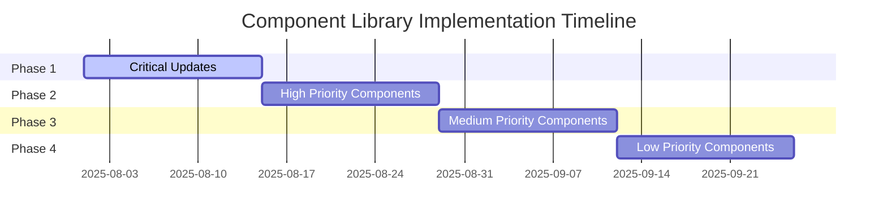

# Additional Components Implementation Plan

## Overview

This document outlines a comprehensive implementation plan for all components in the Riva Ash UI Component Library, based on analysis of the Button, Input, and Badge components. The plan categorizes components by their current status, defines priorities and effort levels, and provides a detailed migration strategy.

## Component Categorization

### Components to Keep from UI Library (with any needed updates)

These components are already well-implemented in the UI library and follow the design system patterns:

1. **Button** - Fully implemented with all variants and states
2. **Input** - Complete with validation states and form field integration
3. **Badge** - Well-designed with consistent styling
4. **Alert** - Properly implemented with all variants
5. **Card Components** (Card, CardHeader, CardTitle, CardDescription, CardContent, CardFooter) - Consistent implementation
6. **Checkbox** - Complete implementation
7. **Select** - Full-featured with options and prompt support
8. **Textarea** - Complete with validation states

### Components to Update from Atomic to Follow UI Library Patterns

These components exist in the atomic library but need to be updated to match UI library patterns:

1. **Avatar** - Needs to follow UI library API patterns and use CSS variables consistently
2. **Date Picker** - Requires updates to match UI library styling and API
3. **Icon** - Needs to follow consistent API patterns
4. **Radio** - Requires updates to match UI library styling and API
5. **Spinner** - Needs to follow UI library patterns and use CSS variables
6. **Text** - Requires updates to match UI library styling and API
7. **TextInput** - Needs significant updates to match Input component features
8. **Time Picker** - Requires updates to match UI library styling and API
9. **Toggle** - Needs to follow UI library patterns and use CSS variables
10. **Tooltip** - Requires updates to match UI library styling and API

### Components that are New Additions

These components need to be created following UI library patterns:

1. **Label** - For form field labeling
2. **Form** - For form layout and validation
3. **Tabs** - For tabbed interfaces
4. **Accordion** - For collapsible content sections
5. **Modal** - For dialog overlays
6. **Popover** - For contextual content displays
7. **Dropdown Menu** - For menu selections
8. **Progress** - For progress indicators
9. **Skeleton** - For loading states
10. **Table** - For data display

## Detailed Component Analysis

### High Priority Components

| Component | Current Status | Priority | Effort | Specific Tasks |
|-----------|----------------|----------|--------|----------------|
| TextInput | Needs updates | High | Medium | Align API with Input component, add validation states, form field integration, use CSS variables |
| Avatar | Implemented in atoms | High | Small | Update to use UI library patterns, ensure CSS variable usage |
| Date Picker | Implemented in atoms | High | Medium | Align with UI library styling, improve API consistency |
| Icon | Implemented in atoms | High | Small | Ensure consistent API, verify CSS variable usage |
| Radio | Implemented in atoms | High | Medium | Align with UI library patterns, improve styling consistency |

### Medium Priority Components

| Component | Current Status | Priority | Effort | Specific Tasks |
|-----------|----------------|----------|--------|----------------|
| Spinner | Implemented in atoms | Medium | Small | Align with UI library patterns, ensure CSS variable usage |
| Text | Implemented in atoms | Medium | Small | Align with UI library patterns, ensure CSS variable usage |
| Time Picker | Implemented in atoms | Medium | Medium | Align with UI library patterns, improve API consistency |
| Toggle | Implemented in atoms | Medium | Medium | Align with UI library patterns, improve styling consistency |
| Tooltip | Implemented in atoms | Medium | Medium | Align with UI library patterns, improve accessibility |

### Low Priority Components

| Component | Current Status | Priority | Effort | Specific Tasks |
|-----------|----------------|----------|--------|----------------|
| Label | Not implemented | Low | Small | Create new component following UI library patterns |
| Form | Not implemented | Low | Large | Create comprehensive form component with validation support |
| Tabs | Not implemented | Low | Medium | Create tabbed interface component |
| Accordion | Not implemented | Low | Medium | Create collapsible content component |
| Modal | Not implemented | Low | Large | Create dialog overlay component |
| Popover | Not implemented | Low | Medium | Create contextual content display component |
| Dropdown Menu | Not implemented | Low | Medium | Create menu selection component |
| Progress | Not implemented | Low | Small | Create progress indicator component |
| Skeleton | Not implemented | Low | Small | Create loading state component |
| Table | Not implemented | Low | Large | Create data display component |

## Migration Strategy

### Order of Implementation

1. **Phase 1: Critical Updates** (Weeks 1-2)
   - Update TextInput to match Input component features
   - Align Avatar, Icon with UI library patterns
   - Ensure consistent CSS variable usage across all atomic components

2. **Phase 2: High Priority Components** (Weeks 3-4)
   - Update Date Picker, Radio, and Toggle components
   - Implement Label component
   - Improve accessibility across all components

3. **Phase 3: Medium Priority Components** (Weeks 5-6)
   - Update Spinner, Text, Time Picker, and Tooltip components
   - Implement Tabs and Accordion components
   - Create initial versions of Modal and Popover

4. **Phase 4: Low Priority Components** (Weeks 7-8)
   - Implement remaining new components (Dropdown Menu, Progress, Skeleton, Table)
   - Finalize Form component with comprehensive validation support

### Handling Component Duplication

1. **Gradual Migration Approach**
   - Maintain both atomic and UI versions during transition
   - Update documentation to recommend UI library components
   - Deprecate atomic components after successful migration

2. **API Alignment Strategy**
   - Ensure new UI components have consistent APIs
   - Use component specifications as the source of truth
   - Provide migration guides for developers

3. **Backward Compatibility**
   - Maintain old components during transition period
   - Provide clear deprecation warnings
   - Ensure gradual migration is possible

### Updating Existing References

1. **Automated Replacement**
   - Create codemods for common patterns
   - Use search and replace for simple cases
   - Manual review for complex cases

2. **Directory-by-Directory Migration**
   - Migrate core components first (auth, layouts)
   - Proceed to business components
   - Finish with supporting components

3. **Testing Strategy**
   - Visual regression testing
   - Functional testing
   - Accessibility testing
   - Performance testing

### Timeline/Phases for Implementation

## Additional Features Identification

Based on analysis of atomic components, the following additional features should be considered:

### Enhanced Form Components

1. **Input Enhancements**
   - Add icon support (left/right positioning)
   - Implement password visibility toggle
   - Add character count functionality
   - Support for input masking

2. **Select Improvements**
   - Add search functionality for large option sets
   - Implement multi-select with tags
   - Add custom option rendering
   - Support for async option loading

3. **Textarea Features**
   - Add auto-resize functionality
   - Implement character limit with counter
   - Add toolbar for rich text editing (basic)

### Accessibility Enhancements

1. **Keyboard Navigation**
   - Ensure all interactive components support keyboard navigation
   - Implement proper focus management
   - Add keyboard shortcuts where appropriate

2. **Screen Reader Support**
   - Improve ARIA attribute usage
   - Add proper labels and descriptions
   - Implement live regions for dynamic content

3. **Color Contrast**
   - Verify all components meet WCAG 2.1 AA standards
   - Implement high-contrast mode support
   - Add reduced motion support

### Component Composition

1. **Compound Components**
   - Create compound components for complex UI patterns
   - Implement consistent parent-child relationships
   - Add context-based state management

2. **Slot-based Customization**
   - Enhance components with flexible slot APIs
   - Allow for custom content injection
   - Provide multiple customization points

### Performance Optimizations

1. **Bundle Size Reduction**
   - Implement tree-shaking support
   - Optimize SVG icons
   - Remove unused CSS

2. **Rendering Optimizations**
   - Implement virtualization for large data sets
   - Optimize re-rendering patterns
   - Add lazy loading support

## Implementation Recommendations

### Technical Approach

1. **Consistent API Design**
   - Use consistent prop naming across all components
   - Implement standardized sizing options (sm, md, lg)
   - Follow established variant patterns

2. **CSS Variable Usage**
   - Ensure all components use design system CSS variables
   - Implement proper fallback values
   - Maintain consistent variable naming

3. **Accessibility by Default**
   - Implement proper focus states
   - Use semantic HTML elements
   - Include ARIA attributes where needed

### Quality Assurance

1. **Testing Strategy**
   - Implement unit tests for all components
   - Add visual regression testing
   - Include accessibility testing
   - Perform cross-browser testing

2. **Documentation**
   - Maintain up-to-date component specifications
   - Provide comprehensive usage examples
   - Include migration guides for deprecated components
   - Document accessibility features

### Rollout Plan

1. **Staged Deployment**
   - Release components in priority order
   - Gather feedback from early adopters
   - Iterate based on usage patterns

2. **Developer Support**
   - Provide migration guides and tools
   - Offer training sessions
   - Maintain clear communication about deprecations

This implementation plan provides a comprehensive roadmap for unifying the Riva Ash component library while maintaining consistency with the design system and improving developer experience.