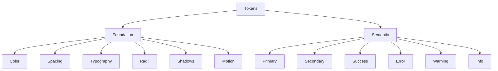

# Design Tokens Audit & Proposal

## Current Token Analysis

### Color System
- **Implementation**: OKLCH-based color system in [`oklch_color_theme.css`](docs/oklch_color_theme.css:1)
- **Strengths**:
  - WCAG-compliant color palette with research-backed values
  - Proper light/dark mode separation with semantic naming
### 3. Button Component Implementation

The button component demonstrates proper use of semantic tokens through Tailwind classes:

```elixir
def button(assigns) do
  ~H"""
  <button class={class([
    "px-4 py-2 rounded-md font-medium text-sm transition-all duration-normal ease-in-out",
    "bg-primary text-primary-foreground hover:bg-primary/90 active:bg-primary/80",
    "focus:outline-none focus:ring-2 focus:ring-ring focus:ring-offset-2"
  ])}>
    <%= render_slot(@inner_block) %>
  </button>
  """
end
```

This implementation:
- Uses `bg-primary` for base color
- Applies `text-primary-foreground` for text contrast
- Implements hover/active states with opacity modifiers
- Maintains accessibility with proper focus styles
  - Consistent use of CSS variables across themes
- **Observations**:
  - No hardcoded color values found in codebase (verified via regex search)
  - All color references use CSS variables (e.g., `var(--primary)`)

### Spacing System
- **Implementation**:
  - Custom `--spacing` variable (`0.3rem`) in CSS
  - Comprehensive Tailwind spacing scale (lines 31-67 in [`tailwind.config.js`](packages/riva_ash/assets/tailwind.config.js:31))
- **Inconsistencies**:
  - Dual system exists (CSS variable + Tailwind scale)
  - No clear relationship between `--spacing` and Tailwind's numeric scale

### Typography
- **Implementation**:
  - Font families defined via CSS variables (lines 51-53 in [`oklch_color_theme.css`](docs/oklch_color_theme.css:51))
  - Tailwind font size scale implemented (lines 16-30 in [`tailwind.config.js`](packages/riva_ash/assets/tailwind.config.js:16))
- **Observations**:
  - Line height values hardcoded in Tailwind config
  - No semantic naming for typographic scales

### Radii & Shadows
- **Implementation**:
  - Base radius (`--radius: 6px`) with Tailwind extensions (lines 68-77 in [`tailwind.config.js`](packages/riva_ash/assets/tailwind.config.js:68))
  - Shadow variables mapped to Tailwind (lines 92-101 in [`tailwind.config.js`](packages/riva_ash/assets/tailwind.config.js:92))
- **Inconsistencies**:
  - Multiple radius definitions (`sm`, `md`, `lg`, `xl`, `2xl`, `3xl`)
  - Shadow variables not consistently used across components

### Motion System
- **Findings**:
  - No dedicated motion tokens found
  - Animation properties hardcoded in components
  - No standard easing functions or duration scales

## Proposed Token Structure (Atomic Design)



### 1. Color System (Enhanced)
```json
{
  "colors": {
    "core": {
      "blue": "oklch(0.52 0.18 275)",
      "teal": "oklch(0.65 0.10 185)",
      "amber": "oklch(0.70 0.22 75)",
      "red": "oklch(0.55 0.20 25)"
    },
    "semantic": {
      "primary": "{core.blue}",
      "secondary": "{core.teal}",
      "accent": "{core.amber}",
      "destructive": "{core.red}"
    },
    "surface": {
      "background": "oklch(0.99 0.002 260)",
      "card": "oklch(0.98 0.002 260)",
      "popover": "oklch(0.97 0.003 260)"
    }
  }
}
```

### 2. Spacing System
| Token | Value | Usage |
|-------|-------|-------|
| `space-0` | 0 | No spacing |
| `space-1` | 0.25rem | Micro elements |
| `space-2` | 0.5rem | Component padding |
| `space-3` | 0.75rem | Section spacing |
| `space-4` | 1rem | Card padding |
| `space-5` | 1.25rem | Section margins |
| `space-6` | 1.5rem | Container padding |

### 3. Motion System (New)
```json
{
  "motion": {
    "duration": {
      "fast": "150ms",
      "normal": "300ms",
      "slow": "500ms"
    },
    "easing": {
      "ease-in": "cubic-bezier(0.4, 0, 1, 1)",
      "ease-out": "cubic-bezier(0, 0, 0.2, 1)",
      "ease-in-out": "cubic-bezier(0.4, 0, 0.2, 1)"
    },
    "transition": {
      "default": "all {duration.normal} {easing.ease-in-out}"
    }
  }
}
```

## Implementation Strategy

1. **Foundation Tokens** (First-order)
   - Create `tokens.json` with atomic values
   - Map to CSS variables in `:root` and `.dark`

2. **Semantic Tokens** (Second-order)
   - Build component-specific tokens from foundation
   - Example: `button-primary-bg: {colors.semantic.primary}`

3. **Component Tokens** (Third-order)
   - Define per-component token sets
   - Example: `card-padding: {spacing.space-4}`

## Migration Plan

1. Phase 1: Implement foundation tokens
2. Phase 2: Update semantic layer
3. Phase 3: Component-level token adoption
4. Phase 4: Deprecate legacy variables

## Next Steps

- [ ] Finalize token naming conventions
- [ ] Create token documentation site
- [ ] Implement token generation pipeline
- [ ] Update component library to use new tokens