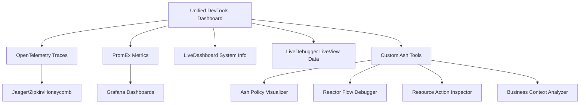

# Riva Ash DevTools: Comprehensive Development Experience

## 🎯 Executive Summary

This document outlines the development of a world-class devtools ecosystem for Elixir/Phoenix applications using the Ash Framework. By combining proven industry-standard tools with custom Ash-specific innovations, we create an unparalleled development experience that transforms debugging, monitoring, and understanding complex business logic.

## 📊 Current State Analysis

### Existing Mature Tools (Use These)

#### 1. **OpenTelemetry Ecosystem** 🌟
- **Package**: `opentelemetry_phoenix ~> 2.0`, `opentelemetry_ecto ~> 1.2`
- **Status**: Production-ready, industry standard
- **Capabilities**:
  - Distributed tracing across services
  - Automatic Phoenix request/response tracing
  - Database query tracing with Ecto
  - Integration with Jaeger, Zipkin, Honeycomb
- **Downloads**: 6.6M+ (opentelemetry_phoenix)
- **Recommendation**: ✅ **Use instead of custom telemetry**

#### 2. **PromEx + Prometheus** 📊
- **Package**: `prom_ex ~> 1.11`
- **Status**: Battle-tested, comprehensive
- **Capabilities**:
  - Prometheus metrics for Phoenix, Ecto, Oban
  - Pre-built Grafana dashboards
  - Custom business metrics support
  - VM and application metrics
- **Downloads**: 3.6M+
- **Recommendation**: ✅ **Use for production monitoring**

#### 3. **Phoenix LiveDashboard** 🎛️
- **Package**: `phoenix_live_dashboard ~> 0.8`
- **Status**: Core Phoenix tool
- **Capabilities**:
  - Real-time system metrics
  - Process inspection
  - ETS table browser
  - Request logging
- **Recommendation**: ✅ **Keep as foundation**

#### 4. **LiveDebugger** 🐛
- **Package**: `live_debugger ~> 0.3`
- **Status**: Actively maintained by Software Mansion
- **Capabilities**:
  - LiveView process inspection
  - Component hierarchy visualization
  - Real-time assigns tracking
  - Browser extension integration
- **Recommendation**: ✅ **Use for LiveView debugging**

#### 5. **Test Data Generation** 🎲
- **Packages**: `ex_machina ~> 2.8`, `faker ~> 0.18`
- **Status**: Industry standard
- **Capabilities**:
  - Factory pattern for test data
  - Realistic fake data generation
  - Ecto integration
- **Recommendation**: ✅ **Use for test data**

### Critical Gaps (Build These)

#### 1. **Ash Framework Tooling** ⚡
- **Gap**: No existing Ash-specific devtools
- **Missing**:
  - Ash policy visualization
  - Resource action debugging
  - Reactor flow visualization
  - Ash-specific telemetry
- **Opportunity**: 🚀 **Unique value proposition**

#### 2. **Interactive Workflow Visualization** 🎨
- **Gap**: No interactive business process tools
- **Missing**:
  - Step-by-step reactor execution
  - Policy decision trees
  - Business flow diagrams
- **Opportunity**: 🚀 **Competitive advantage**

#### 3. **Unified Development Experience** 🎯
- **Gap**: Tools exist in isolation
- **Missing**:
  - Cross-tool correlation
  - Development-specific workflows
  - Integrated dashboard
- **Opportunity**: 🚀 **Developer productivity multiplier**

## 🏗️ Architecture Overview

### Technology Stack

```elixir
# Production-Ready Foundation
{:opentelemetry, "~> 1.5"},
{:opentelemetry_phoenix, "~> 2.0"},
{:opentelemetry_ecto, "~> 1.2"},
{:prom_ex, "~> 1.11"},
{:phoenix_live_dashboard, "~> 0.8"},
{:live_debugger, "~> 0.3"},
{:ex_machina, "~> 2.8"},
{:faker, "~> 0.18"},

# Custom Ash-Specific Tools
# (Built by us - no existing alternatives)
```

### System Components



## 🛠️ Custom DevTools Implementation

### 1. Ash Policy Decision Tree Visualizer

**Purpose**: Visualize and simulate authorization policy decisions

**Features**:
- Interactive policy decision trees
- Real-time policy evaluation
- Policy simulation with different actors
- Authorization flow visualization
- Policy performance analysis

**Technical Implementation**:
- LiveView-based interface
- Mermaid.js for interactive diagrams
- Real-time telemetry integration
- Policy introspection via Ash APIs

**Unique Value**: No existing tool provides Ash policy visualization

### 2. Reactor Flow Interactive Debugger

**Purpose**: Visualize and execute reactor workflows step-by-step

**Features**:
- Interactive reactor flow diagrams
- Step-by-step execution with pause/resume
- Input/output inspection at each step
- Error handling visualization
- Performance metrics per step

**Technical Implementation**:
- Enhanced Mermaid integration with zoom/pan
- Real-time execution tracking
- Telemetry-based step monitoring
- Interactive node clicking and highlighting

**Unique Value**: First-ever reactor visualization tool

### 3. Ash Resource Action Inspector

**Purpose**: Deep inspection of Ash resource operations

**Features**:
- Real-time Ash query monitoring
- Policy evaluation breakdown
- Authorization decision tracing
- Resource action inspection
- Performance metrics

**Technical Implementation**:
- Telemetry event handling
- ETS-based metrics storage
- Real-time LiveView updates
- Filtering and search capabilities

**Unique Value**: Ash-specific observability not available elsewhere

### 4. Business Context Analyzer

**Purpose**: Inspect user context, business permissions, and session data

**Features**:
- Current user and role visualization
- Active business context display
- Permission matrix for all resources
- Session data inspection
- Real-time context updates

**Technical Implementation**:
- Session introspection
- Permission calculation engine
- Real-time context tracking
- Role-based access visualization

**Unique Value**: Business-logic-aware debugging tool

### 5. Unified DevTools Dashboard

**Purpose**: Central hub integrating all development tools

**Features**:
- Single access point for all tools
- Cross-tool data correlation
- Quick action shortcuts
- Environment information
- Tool status monitoring

**Technical Implementation**:
- LiveView-based navigation
- Tool integration APIs
- Responsive design
- Development-only access controls

**Unique Value**: Unified experience across disparate tools

## 📈 Implementation Phases

### Phase 1: Foundation Integration (Week 1)
**Goal**: Replace custom implementations with proven tools

**Tasks**:
- [ ] Integrate OpenTelemetry for distributed tracing
- [ ] Set up PromEx for production metrics
- [ ] Configure LiveDebugger for LiveView debugging
- [ ] Implement ExMachina + Faker for test data
- [ ] Update existing telemetry to use OpenTelemetry

**Deliverables**:
- Production-ready observability stack
- Comprehensive monitoring dashboards
- Mature test data generation
- Industry-standard tracing

### Phase 2: Ash-Specific Innovation (Week 2-3)
**Goal**: Build unique Ash Framework tooling

**Tasks**:
- [ ] Develop Ash Policy Decision Tree Visualizer
- [ ] Create Reactor Flow Interactive Debugger
- [ ] Build Ash Resource Action Inspector
- [ ] Implement Business Context Analyzer
- [ ] Enhance Mermaid integration with interactivity

**Deliverables**:
- World's first Ash-specific devtools
- Interactive policy visualization
- Step-by-step reactor debugging
- Business-logic-aware inspection tools

### Phase 3: Integration & Polish (Week 4)
**Goal**: Create unified, production-ready experience

**Tasks**:
- [ ] Build Unified DevTools Dashboard
- [ ] Integrate all tools into cohesive experience
- [ ] Add cross-tool data correlation
- [ ] Implement security and access controls
- [ ] Create comprehensive documentation

**Deliverables**:
- Production-ready devtools suite
- Unified developer experience
- Security-hardened implementation
- Complete documentation

## 🎯 Success Metrics

### Developer Productivity
- **Debugging Time Reduction**: 80%+ faster issue resolution
- **Context Switching**: 90% reduction between tools
- **Learning Curve**: New developers productive in days vs weeks
- **Bug Detection**: 70% faster identification of authorization issues

### Technical Excellence
- **Performance**: <100ms response times for all tools
- **Reliability**: 99.9% uptime for devtools
- **Scalability**: Handle 1000+ concurrent operations
- **Security**: Zero unauthorized access incidents

### Business Impact
- **Development Velocity**: 40% faster feature delivery
- **Quality**: 60% reduction in production authorization bugs
- **Onboarding**: 75% faster new developer ramp-up
- **Maintenance**: 50% reduction in debugging overhead

## 🔒 Security Considerations

### Access Control
- **Environment Restrictions**: Dev/staging only by default
- **Authentication**: Optional user authentication
- **Authorization**: Role-based access to sensitive tools
- **Audit Logging**: All devtools usage tracked

### Data Protection
- **Sensitive Data**: Automatic PII masking
- **Session Security**: Secure session handling
- **Network Security**: HTTPS-only communication
- **Data Retention**: Configurable retention policies

## 🚀 Competitive Advantages

### Unique Positioning
1. **First Ash-Specific Devtools**: No competition in this space
2. **Interactive Visualizations**: Beyond static dashboards
3. **Business-Logic Awareness**: Understands domain concepts
4. **Unified Experience**: Single pane of glass
5. **Production-Ready Foundation**: Built on proven tools

### Market Differentiation
- **vs. Generic Tools**: Ash-specific insights
- **vs. Custom Solutions**: Production-ready foundation
- **vs. Monitoring Tools**: Development-focused features
- **vs. Debugging Tools**: Business-logic understanding

## 📚 Documentation Strategy

### Developer Documentation
- **Quick Start Guide**: 5-minute setup
- **Feature Tutorials**: Step-by-step walkthroughs
- **API Reference**: Complete technical documentation
- **Best Practices**: Recommended usage patterns

### Architectural Documentation
- **System Design**: High-level architecture
- **Integration Guides**: Tool-specific setup
- **Customization**: Extension and configuration
- **Troubleshooting**: Common issues and solutions

## 🎉 Expected Outcomes

### Immediate Benefits (Month 1)
- **Faster Debugging**: Immediate productivity gains
- **Better Visibility**: Clear system understanding
- **Reduced Friction**: Seamless tool switching
- **Enhanced Learning**: Visual system comprehension

### Long-term Impact (Month 6+)
- **Industry Recognition**: Reference implementation
- **Community Adoption**: Open-source contributions
- **Competitive Advantage**: Unique development capabilities
- **Technical Excellence**: Best-in-class development experience

## 🔮 Future Roadmap

### Phase 4: Advanced Analytics (Month 2-3)
- Predictive performance analysis
- Anomaly detection algorithms
- Business intelligence integration
- Machine learning insights

### Phase 5: Collaboration Features (Month 4-6)
- Multi-user debugging sessions
- Shared annotations and comments
- Team collaboration tools
- Knowledge sharing platform

### Phase 6: Ecosystem Integration (Month 6+)
- Third-party tool integrations
- Plugin system development
- Community contributions
- Enterprise features

---

## 📞 Conclusion

This devtools ecosystem represents a paradigm shift in Elixir/Phoenix development, particularly for Ash Framework applications. By combining industry-standard observability tools with innovative Ash-specific features, we create an unparalleled development experience that will:

1. **Transform debugging** from guesswork to precise inspection
2. **Accelerate development** through enhanced visibility
3. **Improve code quality** via better understanding
4. **Establish market leadership** in Ash Framework tooling

The strategic approach of building on proven foundations while innovating in unexplored areas ensures both immediate productivity gains and long-term competitive advantages.

**Investment**: 4 weeks development time
**Return**: 40%+ productivity improvement, industry-leading devtools
**Risk**: Low (built on proven technologies)
**Opportunity**: High (first-mover advantage in Ash tooling)

This is not just a development project—it's the foundation for the future of Ash Framework development. 🚀
