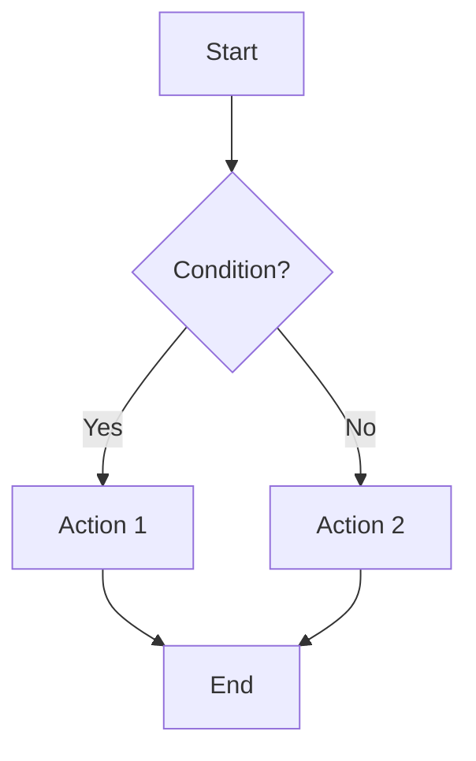

# Workflow Documentation

This directory contains process and workflow documentation for business and technical procedures within the Riva Ash project.

## Directory Structure

### 💼 `business/`
Business process and workflow documentation.

**Content includes:**
- Business process flows
- Operational procedures
- Workflow automation
- Business rule documentation
- Process optimization guides
- Compliance and audit workflows

### 🔧 `technical/`
Technical workflow and process automation documentation.

**Content includes:**
- System integration workflows
- Data processing pipelines
- Technical automation procedures
- System maintenance workflows
- Deployment pipelines
- Monitoring and alerting workflows

### 🤖 `ai-agents/`
AI agent and intelligent workflow documentation.

**Content includes:**
- AI agent configurations
- Intelligent automation workflows
- Machine learning model workflows
- Natural language processing workflows
- Decision automation procedures
- AI integration workflows

## Workflow Standards

All workflow documentation should follow these standards:

### Process Documentation
- **Clear objectives** and business value
- **Step-by-step procedures** with decision points
- **Visual flowcharts** or diagrams where helpful
- **Role and responsibility** definitions
- **Success criteria** and metrics
- **Troubleshooting** procedures

### Technical Workflows
- **Technical prerequisites** and requirements
- **System dependencies** and integration points
- **Automation scripts** and configuration
- **Error handling** and recovery procedures
- **Performance considerations** and optimization
- **Monitoring and alerting** setup

### AI Agent Workflows
- **AI model specifications** and capabilities
- **Training data requirements** and preparation
- **Integration points** with existing systems
- **Performance monitoring** and optimization
- **Ethical considerations** and bias mitigation
- **Continuous improvement** procedures

## Navigation Guide

### For Business Teams
Review [business processes](business/) to understand operational workflows and procedures.

### For Technical Teams
Explore [technical workflows](technical/) for system integration and automation procedures.

### For AI/ML Teams
Consult [AI agent workflows](ai-agents/) for intelligent automation and machine learning procedures.

## Workflow Types

### Business Workflows
- **Document Management**: Creation, approval, and archival processes
- **User Management**: Onboarding, role assignment, and offboarding
- **Compliance**: Audit trails, regulatory compliance, and reporting
- **Customer Service**: Support ticket handling and resolution processes
- **Financial**: Billing, invoicing, and financial reporting workflows

### Technical Workflows
- **CI/CD**: Build, test, and deployment automation
- **Data Processing**: ETL pipelines and data transformation
- **System Monitoring**: Health checks, alerting, and response
- **Backup and Recovery**: Data protection and disaster recovery
- **Performance Optimization**: System tuning and scaling procedures

### AI Agent Workflows
- **Document Classification**: Automatic categorization and tagging
- **Content Generation**: AI-assisted document creation and editing
- **Intelligent Search**: Semantic search and recommendation systems
- **Process Automation**: AI-driven workflow optimization
- **Predictive Analytics**: Forecasting and trend analysis workflows

## Related Documentation

- [Guides Documentation](../guides/) - Step-by-step procedural guides
- [Concept Documentation](../concepts/) - High-level understanding
- [Reference Documentation](../references/) - Technical specifications
- [Audience Documentation](../audience/) - Role-specific information

## Contributing

When creating new workflow documentation:

1. **Determine the workflow type** and appropriate subdirectory
2. **Map the complete process** with all steps and decision points
3. **Include visual aids** (flowcharts, diagrams) for clarity
4. **Define roles and responsibilities** clearly
5. **Add success criteria and metrics** for evaluation
6. **Include troubleshooting procedures** for common issues
7. **Update this README** and relevant index files
8. **Cross-reference** related workflows and documentation

## Maintenance

- **Process Reviews**: Regular review and optimization of workflows
- **Version Control**: Track changes to workflow procedures
- **Performance Monitoring**: Monitor workflow effectiveness and efficiency
- **User Feedback**: Incorporate feedback from workflow participants
- **Archive**: Move deprecated workflows to [archive](../archive/)

## Template for New Workflow Documents

```markdown
---
title: "Workflow Title"
workflow_type: [business, technical, ai-agent]
audience: [developers, administrators, business-users]
version: "1.0.0"
last_updated: "YYYY-MM-DD"
related: ["related-workflow-1.md", "related-workflow-2.md"]
owner: [team-or-person]
---

# Workflow Title

## Overview

Brief description of the workflow, its purpose, and business value.

## Prerequisites

Any requirements, systems, or permissions needed before starting this workflow.

## Workflow Steps

### Step 1: Initial Setup

Detailed instructions for the first step.

**Responsible Role**: [Role responsible for this step]
**Tools Required**: [Tools needed for this step]
**Estimated Time**: [Time required]

### Step 2: Process Execution

Continue with additional steps as needed.

### Decision Points

Any decision points or conditional logic in the workflow.



## Success Criteria

How to measure the success of this workflow.

## Troubleshooting

Common issues and their solutions.

## Related Workflows

- [Related Workflow 1](./related-workflow-1.md)
- [Related Workflow 2](./related-workflow-2.md)

## Version History

| Version | Date | Changes |
|---------|------|---------|
| 1.0.0 | YYYY-MM-DD | Initial version |

## Feedback

How to provide feedback or suggest improvements.