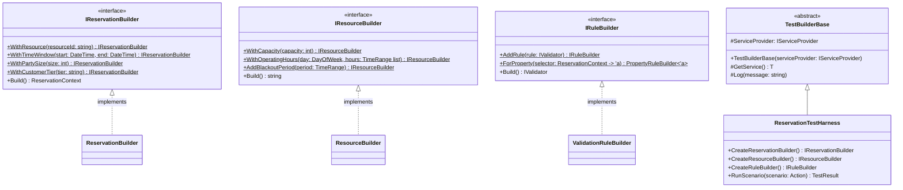

# Reservation Test Framework

## Overview
This framework provides a robust testing solution for reservation scenarios with:
- Fluent builder interfaces
- Dependency injection support
- Composable validation rules
- Extensible test harness



## Documentation
- Project Structure: docs/STRUCTURE.md
- Domain Axioms and Assumptions: docs/DomainAxioms.md
- Test Framework Overview: docs/TestFramework.md
- Validation Template Guide: docs/ValidationTemplateGuide.md
- Feature Inventory and Readiness: docs/FeatureInventory.md
- Car Rental Test Suite Architecture: docs/CarRentalTestSuite.md
- Performance Test Optimization: PERFORMANCE_OPTIMIZATION.md
- F# Style Guide (influenced by Don Syme and Scott Wlaschin): docs/StyleGuide.md

## Quick Start
```fsharp
open ReservationService.Core.Validation.Testing
open Microsoft.Extensions.DependencyInjection

// Set up dependency injection
let services = ServiceCollection()
services.AddLogging() |> ignore
let serviceProvider = services.BuildServiceProvider()

// Create test harness
let harness = ReservationTestHarness(serviceProvider)

// Run simple scenario
let result = harness.RunScenario(fun resBuilder ->
    resBuilder
        .WithResource("room-101")
        .WithTimeWindow(DateTime.Now, DateTime.Now.AddHours(2))
        .WithPartySize(4)
        |> ignore
)

match result with
| Passed msg -> printfn "Success: %s" msg
| Failed (msg, trace) -> printfn "Failed: %s\n%s" msg (String.concat "\n" trace)
```

## Advanced Customization
```fsharp
// Customize the test harness
harness.WithCustomization(fun h ->
    h.Logger.LogInformation("Applying custom configurations")

    // Override builder creation
    h.CreateReservationBuilder <- fun () ->
        CustomReservationBuilder() :> IReservationBuilder
)

// Run complex scenario
harness.RunScenario(fun (res, resource, rules) ->
    resource.WithCapacity(10) |> ignore
    res.WithResource("vip-room").WithPartySize(8) |> ignore

    rules
        .ForProperty(fun ctx -> ctx.PartySize)
        .Must(fun size -> size <= 10)
        |> ignore
)
```

## Domain Examples
- Common: ReservationService.Tests/Domains/Common/Common.ClosedDaysAndNoOverlap.Tests.fs
- Restaurant: ReservationService.Tests/Domains/Restaurant/Restaurant.CapacityAndLeadTime.Tests.fs
- Beach: ReservationService.Tests/Domains/Beach/Beach.Common.Tests.fs

### Debugging
- Set DOMAINS_DEBUG=1 to print merged JSON before rule execution.

## Testing

### Quick Testing (Default)
For fast development cycles, run tests with minimal performance test iterations:
```bash
dotnet test
# OR use the convenience script
./run-tests.sh fast
```

### Performance Testing
For comprehensive performance validation, use different test sizes:

```bash
# Fast tests (default) - minimal iterations for quick feedback
./run-tests.sh fast

# Medium tests - moderate performance testing
./run-tests.sh medium

# Full performance tests - maximum iterations for CI/production validation
./run-tests.sh full
```

### Environment Variables
You can also control test behavior directly with environment variables:

```bash
# Control property-based test iterations
export FS_MAX_TESTS=100        # Number of property test cases
export FS_QUIET=1              # Quiet output for faster runs

# Control performance test size
export PERF_TEST_SIZE=large    # Options: "", "medium", "large"

dotnet test
```

### Test Categories and Filters
```bash
# Run all domain tests
_dotnet test --filter "FullyQualifiedName~ReservationService.Tests.Domains"

# Run specific domain suites
_dotnet test --filter "FullyQualifiedName~ReservationService.Tests.Domains.Common"
_dotnet test --filter "FullyQualifiedName~ReservationService.Tests.Domains.Restaurant"
_dotnet test --filter "FullyQualifiedName~ReservationService.Tests.Domains.Beach"

# Category-based filters (if used elsewhere)
# Run specific test categories
dotnet test --filter "Category=PropertyTests"
dotnet test --filter "FullyQualifiedName~Restaurant"
dotnet test --filter "FullyQualifiedName~Performance"
```