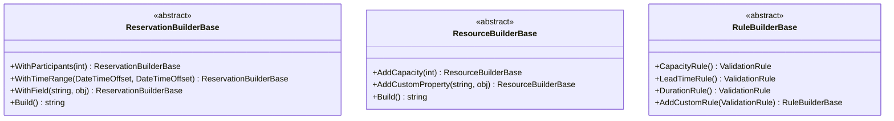

# Reusable Test Framework for Reservation Scenarios

## Overview
This framework provides a standardized approach to testing reservation validation rules across multiple domains. It includes abstract builders for reservations, resources, and rules, along with a test harness for executing validation scenarios.

## Core Components

### Abstract Builders


### Test Harness
The `TestHarness` class provides a standardized way to execute validation tests:
```fsharp
let harness = TestHarness()
harness.SetReservationBuilder(myReservationBuilder)
harness.SetResourceBuilder(myResourceBuilder)
harness.SetRuleBuilder(myRuleBuilder)

// Assert validation passes
harness.AssertValid()

// Assert specific error occurs
harness.AssertInvalidWithCode("CAPACITY_EXCEEDED")
```

## Implementing Domain-Specific Builders

### Beach Domain Example
```fsharp
type BeachReservationBuilder() =
    inherit BaseReservationBuilder()

    member this.WithUmbrellaSize(size: string) =
        this.WithField("umbrellaSize", size) :?> BeachReservationBuilder

type BeachResourceBuilder() =
    inherit BaseResourceBuilder()

    member this.WithBeachSection(section: string) =
        this.AddCustomProperty("section", section) :?> BeachResourceBuilder
```

### Car Rental Domain Example
```fsharp
type CarRentalReservationBuilder() =
    inherit BaseReservationBuilder()

    member this.WithCarType(carType: string) =
        this.WithField("carType", carType) :?> CarRentalReservationBuilder

type CarRentalResourceBuilder() =
    inherit BaseResourceBuilder()

    member this.WithVehicleClass(cls: string) =
        this.AddCustomProperty("vehicleClass", cls) :?> CarRentalResourceBuilder
```

## Adding Custom Validation Rules
```fsharp
type GymRuleBuilder() =
    inherit BaseRuleBuilder()

    override this.CapacityRule() =
        // Custom implementation for gym capacity
        CommonRules.createCapacityRule "GYM_CAPACITY" "participants" "capacity" (Some "Gym capacity exceeded")

    member this.AddAgeRestrictionRule(minAge: int) =
        let rule = // Custom age restriction rule
        this.AddCustomRule(rule)
```

## Extension Guide for New Domains
1. Create domain-specific builders:
   - Inherit from `ReservationBuilderBase`
   - Add domain-specific methods using `WithField()`
2. Implement custom rules:
   - Inherit from `RuleBuilderBase`
   - Override base rules or add new ones
3. Create test scenarios:
   - Use builders to construct test cases
   - Execute validation with `TestHarness`
4. Add assertions:
   - `AssertValid()` for success cases
   - `AssertInvalidWithCode()` for expected failures

### Example Extensions

#### Gym Reservations
```fsharp
type GymReservationBuilder() =
    inherit BaseReservationBuilder()

    member this.WithWorkoutType(workout: string) =
        this.WithField("workoutType", workout) :?> GymReservationBuilder

type GymResourceBuilder() =
    inherit BaseResourceBuilder()

    member this.WithEquipmentCount(equipment: string, count: int) =
        this.AddCustomProperty(equipment, count) :?> GymResourceBuilder
```

#### Parking Reservations
```fsharp
type ParkingReservationBuilder() =
    inherit BaseReservationBuilder()

    member this.WithVehicleType(vehicle: string) =
        this.WithField("vehicleType", vehicle) :?> ParkingReservationBuilder

type ParkingResourceBuilder() =
    inherit BaseResourceBuilder()

    member this.WithParkingType(parkingType: string) =
        this.AddCustomProperty("parkingType", parkingType) :?> ParkingResourceBuilder
```

#### Private Lessons
```fsharp
type PrivateLessonReservationBuilder() =
    inherit BaseReservationBuilder()

    member this.WithInstructor(instructor: string) =
        this.WithField("instructor", instructor) :?> PrivateLessonReservationBuilder

type PrivateLessonResourceBuilder() =
    inherit BaseResourceBuilder()

    member this.WithSkillLevel(level: string) =
        this.AddCustomProperty("skillLevel", level) :?> PrivateLessonResourceBuilder
```

#### Sports Fields
```fsharp
type SportsFieldReservationBuilder() =
    inherit BaseReservationBuilder()

    member this.WithSportType(sport: string) =
        this.WithField("sportType", sport) :?> SportsFieldReservationBuilder

type SportsFieldResourceBuilder() =
    inherit BaseResourceBuilder()

    member this.WithFieldType(fieldType: string) =
        this.AddCustomProperty("fieldType", fieldType) :?> SportsFieldResourceBuilder
```

#### Pet Grooming
```fsharp
type PetGroomingReservationBuilder() =
    inherit BaseReservationBuilder()

    member this.WithPetType(petType: string) =
        this.WithField("petType", petType) :?> PetGroomingReservationBuilder

type PetGroomingResourceBuilder() =
    inherit BaseResourceBuilder()

    member this.WithGroomingService(service: string) =
        this.AddCustomProperty("groomingService", service) :?> PetGroomingResourceBuilder
```

## Supported Domains
- Beach
- Car Rental
- Restaurant
- Gyms
- Parking
- Private Lessons
- Sports Fields
- Pet Grooming